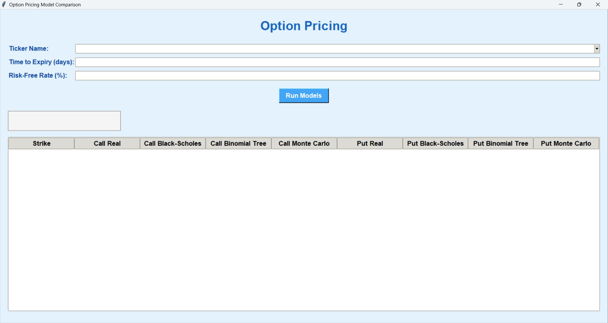
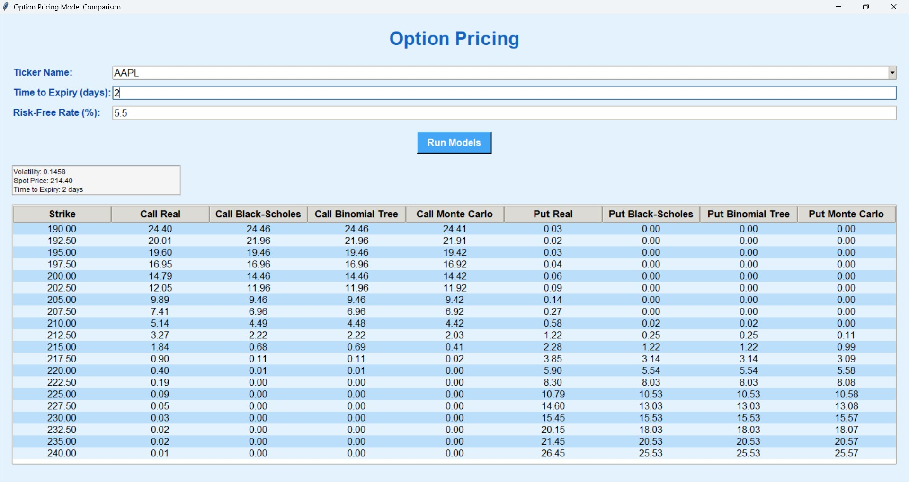

# option-pricing

This project implements **three classic option pricing models** in Python. The main goal was to deepen my understanding of financial derivatives, especially options and to gain practical experience working with Python for financial modeling.

The project also includes a simple **GUI built using Tkinter**, which allows users to input basic parameters and obtain real-time option prices. Real-time market data is fetched using the **Yahoo Finance (via `yfinance`) API**.

---

## Features

- Real-time stock data using `yfinance`
- User-friendly interface built with Tkinter
- Implementation of three pricing models:
  - Black-Scholes Model
  - Binomial Tree Model
  - Monte Carlo Simulation

---

## Models Implemented

### 1. Black-Scholes Model  
A closed-form analytical solution for pricing **European-style options**.  
It uses the following parameters:

- Spot price
- Strike price
- Volatility
- Time to expiry
- Risk-free interest rate

Outputs the theoretical price of **call** and **put** options.

---

### 2. Binomial Tree Model  
A **discrete-time** model where the stock price can move **up or down** at each step. The option values are calculated through **backward induction**.

---

### 3. Monte Carlo Simulation  
A **probabilistic model** that simulates many potential paths of the stock price over time. Here, we computes the option value for each path and the **average** option payoff (discounted) is used as the theoretical price.

---

## Interface Preview 
 Clone the repo and run **gui.py** to get the following interface.    

In the interface, enter the required fields. Autocomplete is available from the dropdown menu for the ticker. The time to expiry closest to the entered value present in the option chain will be used.  
The volatility is calculated based on the historic price of the stock over the past 1 month.  
Below, we see the actual option prices along with the prices found by the 3 models for both puts and calls for varying strike prices.    

---

## References 

1. Hull, J.C. Options, Futures, and Other Derivatives
2. https://github.com/just-krivi/option-pricing-models
   A big thanks to just-krivi who's project inspired me to make a simpler version on my own.

